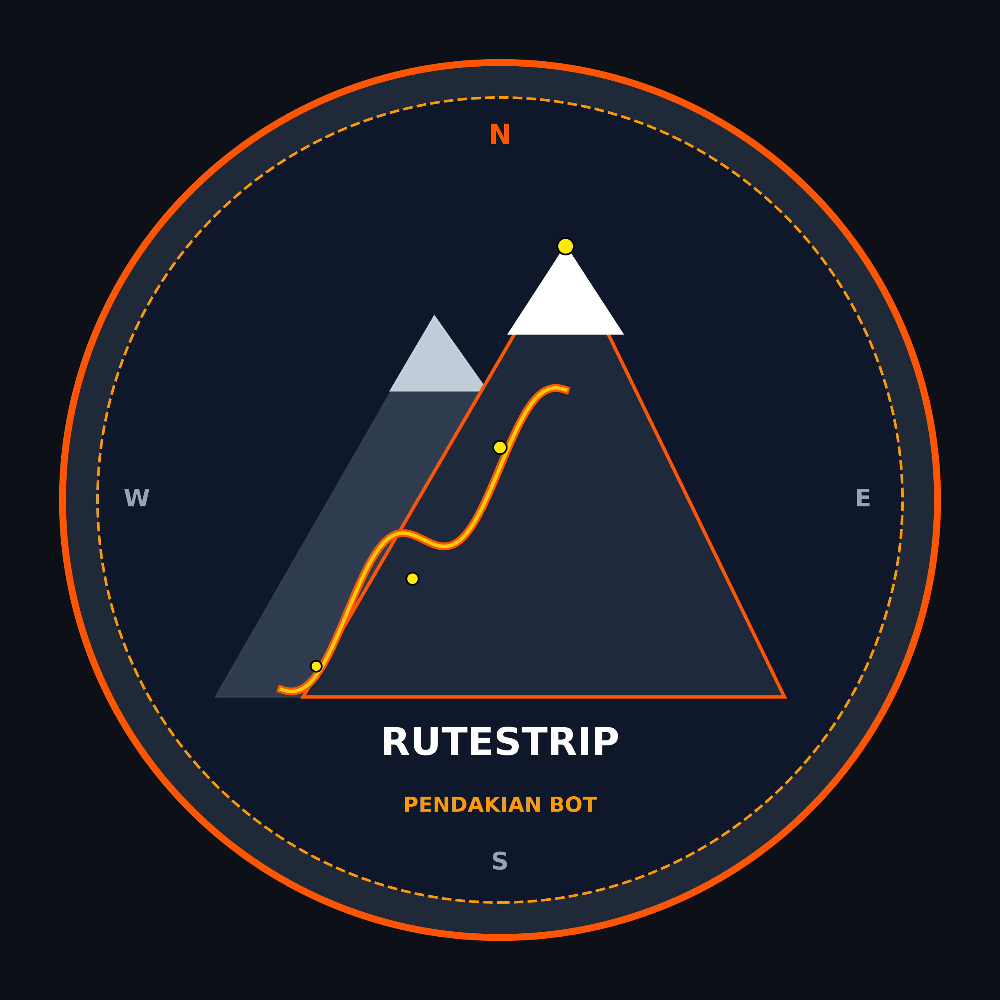

<div align="center">
  
  <h1>🏔️ RuteStrip Pendakian Bot</h1>
  <p><b>Asisten Pintar & Engine Rekomendasi Pendakian Gunung berbasis AI (SBERT), Analisis GPX, Peta Satelit, Topografi Kontur, Forecast Cuaca Realtime, Generator PDF Guidebook, Infografis Story, & Audio Voice Briefing.</b></p>

  [](https://gitlab.com/RamsNotes31/rutestrip-bot)
  [](https://python.org)
  [](LICENSE)
</div>

---

## 🖥️ Platform Ekosistem & Layanan RuteStrip

RuteStrip hadir sebagai platform terpadu pemandu dan data navigasi pendakian gunung di Pulau Jawa & Bali:

* 🌐 **Website Utama:** [https://rutestrip.web.id](https://rutestrip.web.id)
* 🤖 **AI Chat Web App:** [https://airutestrip.web.id](https://airutestrip.web.id)
* 📊 **Live Monitoring Dashboard:** `https://airutestrip.web.id/monitoring` *(Port 9000)*
* 🚀 **Interactive REST API Docs:** `http://localhost:8000/docs`
* 💬 **Grup Telegram Komunitas:** [@rutestrip_group](https://t.me/rutestrip_group)
* 📢 **Channel Telegram Resmi:** [@rutestrip](https://t.me/rutestrip)

---

## ⚡ Quickstart: One-Click Automated Installer (VPS Ubuntu)

Untuk memasang seluruh ekosistem RuteStrip Bot di VPS baru secara otomatis, jalankan **1 baris perintah** di terminal:

```bash
curl -fsSL https://gitlab.com/RamsNotes31/rutestrip-bot/-/raw/main/install.sh | bash
```

### 📦 Yang Dikonfigurasi Otomatis oleh Installer v2.0:
1. **Paket Sistem & Dependency Python:** `git`, `ffmpeg`, `uv`, PyTorch CPU, SBERT, ReportLab (PDF Engine), Matplotlib, Contextily, Psutil, & Edge-TTS.
2. **Framework Hermes & Custom Skill:** Skill `pendakian-jawa` otomatis dipasang ke `~/.hermes/skills/` dengan isolasi multi-user aman.
3. **Database GPX & Navigasi Offline:** 55+ file trek GPX/KML, database ulasan `reviews.json`, info komunitas, dan riwayat siaran.
4. **17 Jadwal Cronjob Otomatis:** Pemantau cuaca berkala, buletin channel, rekomendasi akhir pekan, tips survival, hingga notifikasi realtime pendaftaran user baru.
5. **Konfigurasi Menu Telegram (`/`):** Menyinkronkan 16 menu perintah resmi ke Telegram Bot API (`setMyCommands`) dan membersihkan menu teknis admin dari akses publik.

---

## 🌟 Fitur Utama & Arsitektur Sistem

### 1. 🔒 Keamanan Lapis Ganda & Isolasi Multi-User
* **Public Open Policy (`dm_policy: open`):** Pengguna baru di Telegram dapat langsung mengobrol dan menggunakan fitur tanpa perlu proses *pairing*.
* **Zero-Tools Sandbox (User Biasa):** Sesi pengguna umum secara teknis diberikan **0 toolset** (tanpa akses terminal, tanpa file I/O, tanpa docker, tanpa 9Router).
* **Hak Akses Admin Eksklusif:** Perintah sistem, eksekusi kode, modifikasi bot, dan tools VPS **hanya dapat diakses oleh Admin Ramadhana** (`User ID: 606533609`).

### 2. 🤖 Engine Rekomendasi AI (SBERT + Cosine Similarity)
* Menggunakan model `sentence-transformers/paraphrase-multilingual-MiniLM-L12-v2` (384 dimensi).
* Pencarian semantik cerdas berdasarkan karakteristik trek (contoh: *jalur landai untuk pemula*, *sabana luas camping ceria*).
* Dilengkapi kalkulasi telemetri 3D: Elevasi, Jarak, Grade Kemiringan %, dan Estimasi Durasi Naismith.

### 3. 📄 Generator E-Guidebook PDF Resmi
* Otomatis membuat dokumen PDF panduan lengkap siap cetak (`guidebook <gunung>` / `pdf <gunung>`).
* Berisi profil elevasi, tabel komparasi jalur resmi, detail itinerary 2D1N per pos, manajemen air/logistik, mitigasi hipotermia, dan aturan *Zero Waste*.

### 4. 📱 Generator Poster Infografis Story (9:16)
* Mengolah visual poster vertikal rasio 9:16 siap dibagikan ke Instagram Story / WhatsApp Status (`story <gunung>` / `infografis <gunung>`).
* Menampilkan ringkasan cerita/legenda gunung, trio puncak, kaldera, dan statistik teknis rute.

### 5. 🌦️ Prakiraan Cuaca Live, Wind Chill & Hipotermia
* Integrasi realtime dengan API satelit cuaca (Open-Meteo).
* **Kalkulator Wind Chill (NOAA):** Menghitung suhu terasa (*feels-like*) berdasarkan kombinasi suhu aktual dan kecepatan angin puncak.
* **4-Level Risiko Hipotermia:** Memberikan rekomendasi *layering* pakaian dan perlengkapan perlindungan dingin.

### 6. 🗺️ Peta Citra Satelit & Topografi 3D
* **Peta Satelit:** Overlay rute trek di atas citra satelit resolusi tinggi (`satelit <gunung>`).
* **Peta Topografi Kontur:** Visualisasi elevasi dan garis kontur fisik (`heatmap <gunung>`).
* **Export Offline:** Unduh file `.gpx` & `.kml` untuk Garmin, OsmAnd, dan Avenza Maps.

### 7. ⏱️ Kalkulator Itinerary, Logistik & Patungan (Split Bill)
* **Naismith Itinerary:** Timeline jam per pos (Mode 2D1N atau Tektok).
* **Kalkulator Logistik & Air:** Estimasi perbekalan air dan ransum kalori harian.
* **Kalkulator Patungan (Split Bill):** Menghitung pembagian rata biaya simaksi, logistik, carter transport, porter, dan kas darurat tim (`patungan <gunung> <orang> <hari>`).

### 8. 🎙️ Audio Voice Note & Teks Briefing Ranger
* Sintesis audio suara pemandu lokal Indonesia (`id-ID-ArdiNeural` via Edge-TTS).
* Disajikan dalam format ganda: Teks Markdown + Bubble Voice Note Telegram (`briefing <gunung>`).

---

## 🚀 Daftar Perintah & Navigasi Bot

Pengguna dapat menggunakan kata kunci langsung di chat (tanpa tanda `/`):

| Kategori | Perintah | Deskripsi | Contoh Penggunaan |
|---|---|---|---|
| **Informasi** | `info <gunung>` | Detail pos, rute & simaksi | `info merbabu` |
| **Informasi** | `rekomendasi <kriteria>` | Rekomendasi rute AI SBERT | `rekomendasi pemula sabana` |
| **Informasi** | `briefing <gunung>` | Teks & Audio briefing ranger | `briefing sumbing` |
| **Dokumen** | `guidebook <gunung>` / `pdf` | Download E-Guidebook PDF resmi | `pdf sumbing` |
| **Dokumen** | `story <gunung>` / `infografis` | Poster visual elevasi 9:16 | `story prau` |
| **Cuaca** | `cuaca [gunung]` | Live cuaca & analisis wind chill | `cuaca slamet` |
| **Peta** | `satelit [gunung]` | Peta citra satelit rute & pos | `satelit arjuno` |
| **Peta** | `heatmap [gunung]` | Peta kontur topografi elevasi | `heatmap merbabu` |
| **Peta** | `gpx <gunung>` / `kml` | Download file GPS trek offline | `gpx lawu` |
| **Manajemen** | `itinerary <gunung> [mode]` | Estimasi waktu jalan Naismith | `itinerary sumbing 2d1n` |
| **Manajemen** | `logistik <orang> <hari>` | Kalkulator ransum & air | `logistik 4 2` |
| **Manajemen** | `biaya <gunung> <orang> <hari>` | Estimasi total budget pendakian | `biaya merbabu 3 2` |
| **Manajemen** | `patungan <gunung> <orang> <hari>` | Kalkulator split bill kas tim | `patungan prau 4 2` |
| **Survival** | `survival <topik>` | Mitigasi hipotermia & first aid | `survival hipotermia` |
| **Basecamp** | `porter <gunung>` | Kontak basecamp, ojek & porter | `porter sindoro` |
| **Bantuan** | `help` / `menu` | Menampilkan menu lengkap | `help` |

---

## ⏰ 17 Sistem Otomasi & Cronjob Scheduler

Sistem dilengkapi 17 tugas latar belakang yang berjalan otomatis:
1. `monitoring-cuaca-gunung` (Setiap 3 Jam): Update cuaca live seluruh gunung Jawa & Bali.
2. `broadcast-cuaca-jateng-diy-jabar` (Setiap 6 Jam): Siaran cuaca wilayah Jateng, DIY, & Jabar ke grup.
3. `broadcast-cuaca-jabar-jatim-bali` (Setiap 6 Jam): Siaran cuaca wilayah Jabar, Jatim, & Bali ke grup.
4. `daily-mountain-digest-user-dm` (Setiap 24 Jam): Ringkasan cuaca, rute & survival ke DM user.
5. `rekomendasi-weekend-getaway` (Setiap 12 Jam): Rekomendasi rute pendakian akhir pekan.
6. `tips-survival-pendaki` (Setiap 12 Jam): Edukasi keselamatan & etika pendaki.
7. `portal-news-pendakian` (Setiap 12 Jam): Update berita pendakian media nasional.
8. `channel-bulletin-rutestrip` (Setiap 24 Jam): Buletin info jalur & cuaca di channel resmi.
9. `mountain-newsletter` (Setiap 24 Jam): Artikel & wawasan konservasi gunung.
10. `info-komunitas-rutestrip` (Setiap 24 Jam): Info tautan channel dan grup komunitas.
11. `panduan-penggunaan-bot` (Setiap 24 Jam): Tutorial penggunaan fitur bot ke grup.
12. `notif-pengguna-baru-admin` (Setiap 1 Menit): Notifikasi realtime pendaftaran user Telegram baru ke Admin.
13. `notif-pengguna-baru-webchat` (Setiap 1 Menit): Notifikasi realtime pendaftaran user WebChat baru ke Admin.
14. `reporter-eksekusi-cron` (Setiap 5 Menit): Monitoring kesehatan scheduler (hanya alert jika ada kendala).
15. `rekap-laporan-subscriber` (Setiap 24 Jam): Laporan pertumbuhan total subscriber.
16. `random-auto-readme-commit` (Setiap 3 Jam): Pemeliharaan repositori GitLab.
17. `auto-cleanup-broadcast` (Setiap 6 Jam): Pembersihan pesan siaran kadaluarsa.

---

## 📄 Lisensi & Kontributor

Dikembangkan oleh **Rama Danadipa** ([@RamsNotes31](https://gitlab.com/RamsNotes31)) untuk ekosistem **RuteStrip Indonesia**.  
Didistribusikan di bawah lisensi **MIT License**.

*Salam Lestari & Salam Pendaki Indonesia! 🏕️🥾*


<!-- AUTO_SYNC_START -->
> 🔄 *Last Automated Status Check: 2026-09-21 06:03:36 WIB*
<!-- AUTO_SYNC_END -->